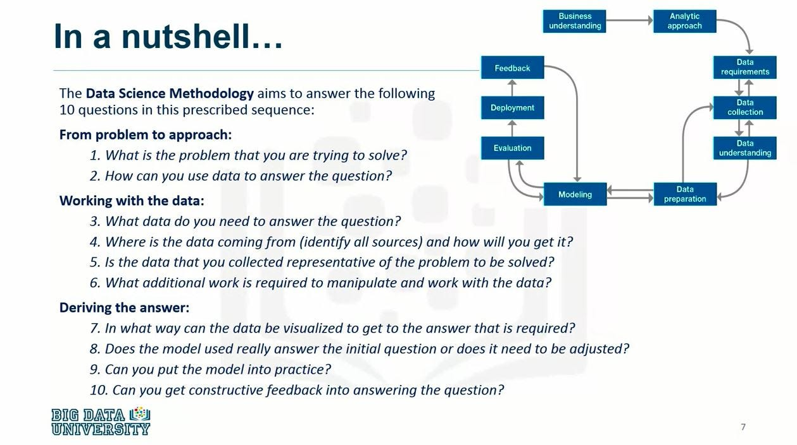

# IBM Data Science Methodology

## 1. Business Understanding
The Business Understanding phase is a critical starting point for any data science project. It involves gaining a comprehensive understanding of the business problem and the objectives to be achieved. This step includes identifying key stakeholders and clearly defining the context in which the problem exists.

## 2. Analytic Approach
In this phase, you decide on the most effective analytic approach to solve the problem identified in the Business Understanding phase. It involves selecting the appropriate data analysis techniques and algorithms to obtain the desired answers.

## 3. Data Requirements
The Data Requirements phase entails identifying the data needed to support the analysis process. This might involve specifying what data is required, where it comes from, and how it will be collected.

## 4. Data Collection
Data Collection is the process of gathering the data identified in the previous phase. This includes cleaning, transforming, and preparing the data to be ready for analysis. Ensuring data accuracy and completeness is crucial.

## 5. Data Understanding
In this phase, you explore the data to gain a deeper understanding of it. This involves visualizing the data, identifying patterns, significant relationships, and trends within the data.

## 6. Data Preparation
Data Preparation is the phase where data is readied for analysis. This can include feature engineering, handling missing data, and normalizing or standardizing the data. The goal is to obtain high-quality data ready for modeling.

## 7. Modeling
The Modeling phase is where you construct analytical or predictive models. You select the appropriate algorithms and train the models. In this phase, it's also crucial to define how model performance will be evaluated.

## 8. Evaluation
The Evaluation phase involves assessing model performance against business objectives. Evaluation metrics are used to determine the effectiveness of the models. If models do not meet the objectives, optimization or modifications may be necessary.

## 9. Deployment
Deployment is the phase where the developed models or solutions are implemented in a production environment. This step involves putting the solutions in place so that they can be used by those who need them.

## 10. Feedback
The Feedback phase involves continuously monitoring model performance in production. Gathering feedback from users and identifying potential real-world issues or challenges is essential.

## 11. Iteration
Iteration is an important step where, if necessary, you go back to previous phases to make improvements or adapt to changing business needs. This iterative cycle helps keep models and solutions up-to-date and relevant.

## Author
John B. Rollins,